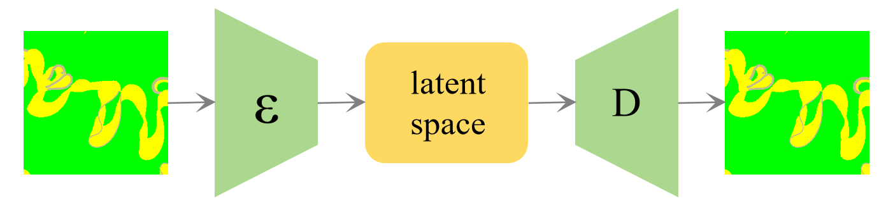
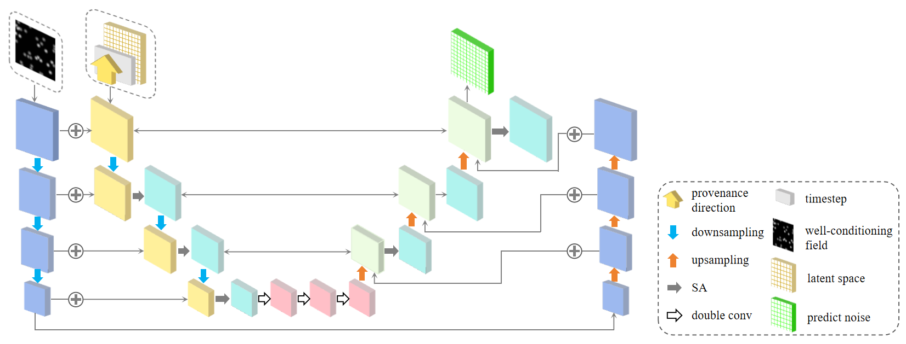

# MDC-LDM







### **What is this repository for?**

------

MDC-LDM is the code implementation for the paper *"Reservoir Facies Modeling under Multiple Depositional Conditions Using Latent Diffusion Models."*.

------


### Who do I talk to?

------

Yu Sun； 
a. School of Earth Sciences, Northeast Petroleum University, Daqing 163318, China;
b. National Key Laboratory of Continental Shale Oil, Northeast Petroleum University, Daqing, Heilongjiang 163318, China

E-mail: [sunyu_hc@163.com](mailto:sunyu_hc@163.com;);

------


### Usage

------

1. **Train the VAE model**:
    Open `MDC-LDM\model\trainers\train_VAE.py`.
    Set the training image path with `--dataset_path` and the result saving path with `--result_path`.
2. **Train the LDM model**:
    Open `MDC-LDM\model\trainers\train_LDM.py`.
    Set the training image path with `--dataset_path` and the result saving path with `--result_path`.
3. **Customize training parameters**:
    During training, you can specify different parameters such as activation function (`--act`), optimizer (`--optim`), learning rate scheduler (`--lr_func`), etc.
4. **Generate reservoir facies samples**:
    Use `generate.py` in `MDC-LDM\generate` to generate facies samples.

------


### 📁 Project Structure

```yaml
├── MDC-LDM
│   ├── config
│   │   ├── choices.py
│   │   ├── model_list.py
│   │   └── setting.py
│   ├── model
│   │   ├── modules
│   │   │   ├── activation.py
│   │   │   ├── attention.py
│   │   │   ├── block.py
│   │   │   ├── conv.py
│   │   │   ├── ema.py
│   │   │   └── module.py
│   │   ├── networks
│   │   │   ├── vae
│   │   │   │   └── autoencoder.py
│   │   │   ├── base.py
│   │   │   └── unet.py
│   │   └── trainers
│   │       ├── base.py
│   │       ├── train_LDM.py
│   │       ├── train_VAE.py
│   │       ├── trainer_LDM.py
│   │       └── trainer_VAE.py
│   ├── generate
│   │   ├── FID_calculator_plus.py
│   │   ├── constraint_acc.py
│   │   ├── generate_VAE.py
│   │   └── generate-latent.py
│   └── utils
│       ├── check.py
│       ├── checkpoint.py
│       ├── dataset.py
│       ├── initializer.py
│       ├── logger.py
│       ├── loss.py
│       ├── lr_scheduler.py
│       ├── metrics.py
│       ├── processing.py
│		├── datasetvae.py
│       └── utils.py
└── 
```


------


